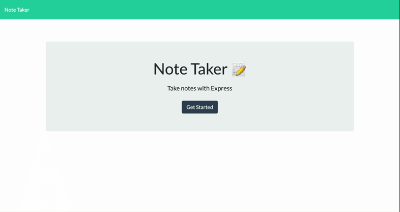

# Note Taker


## Table of Contents
* [Live Application](#live-application)
* [Description](#description)
* [Technologies](#technologies)
* [Installation](#installation)
* [Usage](#usage)
* [Application Demo](#application-demo)
* [License](#license)
* [Contact](#contact)


## Live Application
Visit the [live application](https://morning-ridge-84115.herokuapp.com/) on Heroku to test the features!


## Description
Minimal Node.js and Express powered web application for writing, referencing, and storing notes. Includes a mini-database for storing saved notes and simple API for performing basic CRUD operations.


## Technologies
**Core Technologies:**  
JavaScript, Node.js, Express, HTML, CSS


## Installation
This application requires Node.js and npm to run. To check whether Node.js and npm are installed locally, run:
```
node -v
```
```
npm -v
```
If Node and npm are already installed, the commands above should return version numbers. Visit [Node.js](http://www.nodejs.org/) and [npm](https://docs.npmjs.com/downloading-and-installing-node-js-and-npm) for full installation details and documentation.  

Note Taker also requires the installation of `express`, `shortid`, and `nodemon` from npm to run properly in a local dev environment. To install the project's npm dependencies, navigate to the project's root directory and run:
```
npm install
```
Once all third-party packages have been successfully installed, the application is ready to use. For more details, reference the application's `package.json` file.


## Usage
To launch the application and start the server from a local dev environment, navigate to the project's root directory and run:
```
npm start
```
Alternatively, running this `nodemon` script from the project's root directory will start the server, keep it listening for any changes made to its source code, and automatically restart the server once changes are detected (use `^C` to stop the server):
```
npm run watch
```
**Features:**
* **Intuitive UI:** The application's semantic icons and simple layout make it easy to interact with.
* **Built in API:** Support for creating and saving notes to the database, deleting notes from the database, and viewing all saved notes in JSON format. Support for updating existing notes coming soon.
* **Self-Generated IDs:** Every saved note uses the `shortid` module to generate a unique alphanumeric id used for accessing and manipulating individual notes.


## Application Demo
The following video demonstrates the application's basic features including adding notes, viewing notes, and deleting notes. This video can be used to supplement the rest of the application's documentation: 




## License
Copyright (c) 2021 J.K. Royston  
Licensed under the [MIT License](https://opensource.org/licenses/MIT).


## Contact
J.K. Royston  
<jkroyston@gmail.com>  
[GitHub](https://www.github.com/jxhnkndl)